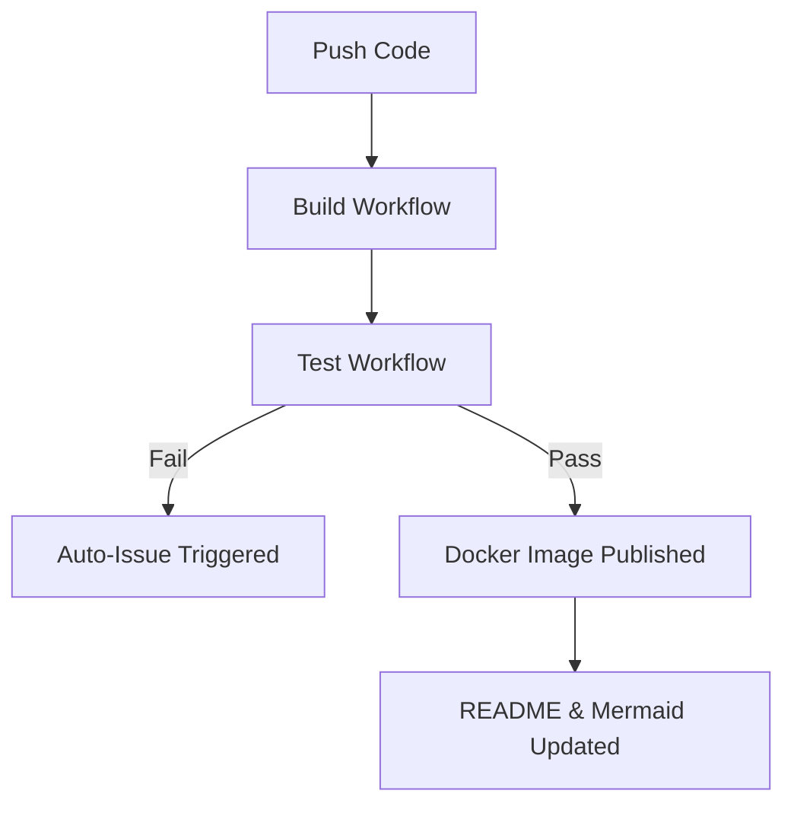

# OTG-TAK: On-The-Go TAK Deployment

A comprehensive mobile solution for automating the deployment and setup of TAK (Team Awareness Kit) Servers with security hardening, networking integration, and tactical operational tools.

## 🧭 Repository Status

| Workflow | Status | Description |
|----------|--------|-------------|
| **Build** |  | Packages backend/frontend into Docker images |
| **Test** |  | Runs automated backend + frontend tests |
| **Issue Watcher** |  | Opens issue when a workflow fails |
| **Docs** |  | Auto-generates repo diagram and README |

## Features

### 🚀 Automated Deployment
- **TAK Server Provisioning**: Automated setup and configuration
- **Dual Deployment Options**:
  - Local (Bare Metal) deployment
  - Cloud deployment using Terraform + Docker containers
- **Interactive Setup**: Configure deployments through an intuitive dashboard

### 🔒 Security & Monitoring
- **Automated Security Hardening**: Lynis integration for continuous security scanning
- **Firewall Configuration**: UFW and fail2ban setup
- **Security Monitoring**: Cron jobs and Ansible playbooks for automated security audits
- **Real-time Alerting**: Notification system for security events

### 🌐 Networking
- **Tailscale Integration**: Secure mesh networking
- **Zerotier Support**: Alternative VPN solution
- **Traefik Reverse Proxy**: Automated SSL/TLS certificate management
- **Multi-network Support**: Connect through multiple secure channels

### 📡 ISR Capabilities
- **MediaMTX Server**: Real-time ISR (Intelligence, Surveillance, Reconnaissance) feed streaming
- **RTSP/HLS/WebRTC Support**: Multiple streaming protocols
- **Feed Management**: Configure and monitor live video feeds

### 📱 Client Onboarding
- **QR Code Generator**: Quick ATAK/iTAK client onboarding
- **Batch Generation**: Create multiple client configurations
- **Secure Configuration**: Embedded certificates and credentials

### 🗺️ Tactical Tools
- **Data Package Builder**: Create and distribute TAK data packages
- **Route Package Builder**: Design navigation routes with waypoints
- **SDR Builder**: Surveillance Detection Route planning with threat assessment
- **File Converter**: Convert between KML and KMZ formats
- **POI Tracker**: Track Persons of Interest with categories and metadata
- **Shared Notepad**: Collaborative notes accessible to all TAK clients

### 📊 Monitoring & Visualization
- **Server Status Dashboard**: Real-time system metrics
- **Service Health Monitoring**: Track all running services
- **Resource Utilization**: CPU, memory, disk, and network monitoring
- **Deployment Progress Tracker**: Monitor deployment status in real-time

## Architecture

```
otg-tak/
├── backend/           # FastAPI backend server
│   ├── app/
│   │   ├── api/      # API endpoints
│   │   ├── core/     # Configuration & database
│   │   ├── models/   # Database models
│   │   └── services/ # Business logic
│   └── main.py
├── frontend/          # React dashboard
│   └── src/
│       ├── components/
│       ├── pages/
│       └── services/
├── ansible/           # Ansible playbooks
│   └── playbooks/
│       ├── install-tak-server.yml
│       ├── security-hardening.yml
│       ├── setup-networking.yml
│       ├── setup-traefik.yml
│       └── setup-mediamtx.yml
├── terraform/         # Cloud infrastructure
│   └── modules/
│       ├── tak-server/
│       ├── networking/
│       └── security/
└── docker-compose.yml
```

## Quick Start

### Prerequisites
- Docker and Docker Compose
- Python 3.11+
- Node.js 18+
- Ansible (for automation)
- Terraform (for cloud deployment)

### Installation

1. **Clone the repository**
   ```bash
   git clone https://github.com/cywf/otg-tak.git
   cd otg-tak
   ```

2. **Configure environment variables**
   ```bash
   cp .env.example .env
   # Edit .env with your configuration
   ```

3. **Start with Docker Compose**
   ```bash
   docker-compose up -d
   ```

4. **Access the dashboard**
   - Frontend: http://localhost:3000
   - Backend API: http://localhost:8000
   - API Documentation: http://localhost:8000/docs

### Manual Setup

#### Backend
```bash
cd backend
pip install -r ../requirements.txt
uvicorn main:app --reload
```

#### Frontend
```bash
cd frontend
npm install
npm run dev
```

## Deployment Options

### Local Deployment (Bare Metal)

1. Configure your inventory in `ansible/inventory`
2. Run the deployment playbooks:
   ```bash
   cd ansible
   ansible-playbook playbooks/install-tak-server.yml
   ansible-playbook playbooks/security-hardening.yml
   ansible-playbook playbooks/setup-networking.yml
   ansible-playbook playbooks/setup-traefik.yml
   ```

### Cloud Deployment (AWS)

1. Configure Terraform variables in `terraform/terraform.tfvars`
2. Deploy infrastructure:
   ```bash
   cd terraform
   terraform init
   terraform plan
   terraform apply
   ```

## API Endpoints

### Deployment
- `POST /api/deployment/create` - Create new deployment
- `GET /api/deployment/status/{id}` - Get deployment status
- `GET /api/deployment/list` - List all deployments

### QR Generator
- `POST /api/qr/generate` - Generate QR code for client
- `POST /api/qr/batch-generate` - Batch generate QR codes

### Data Packages
- `POST /api/packages/create` - Create data package
- `GET /api/packages/list` - List packages
- `POST /api/packages/upload` - Upload package file

### Routes
- `POST /api/routes/create` - Create route package
- `GET /api/routes/list` - List routes

### SDR
- `POST /api/sdr/create` - Create SDR
- `GET /api/sdr/list` - List SDRs
- `GET /api/sdr/{id}` - Get SDR details

### File Converter
- `POST /api/convert/kml-to-kmz` - Convert KML to KMZ
- `POST /api/convert/kmz-to-kml` - Convert KMZ to KML

### Server Status
- `GET /api/status/current` - Get current server status
- `GET /api/status/metrics/history` - Get historical metrics
- `GET /api/status/services` - Get services status

### POI Tracker
- `POST /api/poi/create` - Create POI
- `GET /api/poi/list` - List POIs
- `GET /api/poi/{id}` - Get POI details
- `PUT /api/poi/{id}` - Update POI
- `DELETE /api/poi/{id}` - Delete POI

### Notepad
- `POST /api/notes/create` - Create note
- `GET /api/notes/list` - List notes
- `GET /api/notes/{id}` - Get note details
- `PUT /api/notes/{id}` - Update note
- `DELETE /api/notes/{id}` - Delete note

## Configuration

### Environment Variables

```env
# Database
DATABASE_URL=sqlite:///./data/otg-tak.db

# Security
SECRET_KEY=your-secret-key

# Tailscale
TAILSCALE_AUTH_KEY=your-auth-key

# Zerotier
ZEROTIER_NETWORK_ID=your-network-id
ZEROTIER_API_TOKEN=your-api-token

# TAK Server
TAK_SERVER_DEFAULT_PORT=8089
```

## Security Features

- **Lynis Security Auditing**: Automated daily security scans
- **Fail2ban**: Intrusion prevention
- **UFW Firewall**: Network security
- **SSL/TLS**: Automatic certificate management with Let's Encrypt
- **Encrypted Communications**: All TAK traffic encrypted
- **Security Event Monitoring**: Real-time alerting

## Contributing

Contributions are welcome! Please read our contributing guidelines and submit pull requests.

## License

This project is licensed under the MIT License - see the LICENSE file for details.

## Support

For issues and questions:
- Open an issue on GitHub
- Contact: support@otg-tak.example.com

## 🧩 Workflow Overview



## Acknowledgments

- TAK (Team Awareness Kit) community
- FreeTAKServer project for inspiration
- All open-source contributors

---

**Note**: This is a development project. Ensure proper security measures are in place before deploying in production environments.

## 🧬 Repository Structure (Auto-Generated)

View the [Repository Structure](./REPO_STRUCTURE.md) for a detailed overview of the project organization.

## 🗺️ Live Codebase Mindmap

Auto-generated on each push: **repo-map.html** (via GitHub Pages and CI artifact).
When Pages is enabled, it will be served at: `https://cywf.github.io/otg-tak/repo-map.html`
