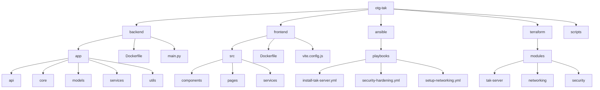

# Repository Structure

This file is auto-generated and shows the structure of the OTG-TAK repository.

## Directory Tree

```
.
├── CHANGELOG.md
├── CONTRIBUTING.md
├── INSTALL.md
├── LICENSE
├── Makefile
├── PROJECT_SUMMARY.md
├── README.md
├── REPO_STRUCTURE.md
├── ansible
│   ├── ansible.cfg
│   ├── inventory
│   └── playbooks
├── backend
│   ├── Dockerfile
│   ├── app
│   └── main.py
├── docker-compose.yml
├── frontend
│   ├── Dockerfile
│   ├── index.html
│   ├── src
│   └── vite.config.js
├── mermaid
│   ├── architecture.mmd
│   ├── bpmnish.mmd
│   ├── ci-sequence.mmd
│   ├── er.mmd
│   └── flowchart.mmd
├── package.json
├── quick-start.sh
├── requirements.txt
├── scripts
│   ├── generate-markmap.mjs
│   ├── generate-mermaid.mjs
│   └── health-check.sh
├── site
│   ├── README.md
│   ├── astro.config.mjs
│   ├── package-lock.json
│   ├── package.json
│   ├── public
│   ├── scripts
│   ├── src
│   ├── tailwind.config.mjs
│   └── tsconfig.json
└── terraform
    ├── main.tf
    ├── modules
    └── variables.tf

15 directories, 35 files
```

## Mermaid Diagram



---
*Last updated: $(date -u '+%Y-%m-%d %H:%M:%S UTC')*
